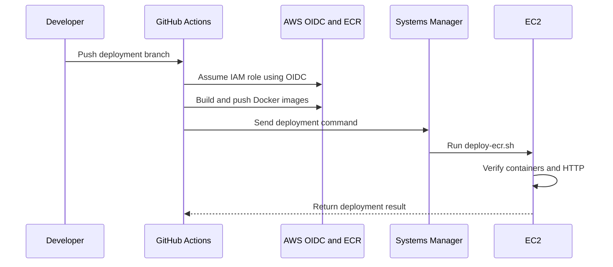

# Thinkz AI CI/CD Pipeline

## Owner

- Name: RK Reddy
- Role: DevOps Cloud Engineer

## Pipeline

## Configuration

- Workflow: `.github/workflows/deploy-prod.yml`
- Branch: `thinkz-ai-ec2-deployment`
- Manual trigger: `workflow_dispatch`
- Region: `ap-south-2`
- EC2 instance: `i-02fe2f396176b851a`
- Authentication: GitHub OIDC
- Deployment: AWS SSM Run Command

## ECR Repositories

- Backend: `thinkz-ai-backend`
- Frontend: `thinkz-ai-frontend`
- Image tags: Git commit SHA and `latest`

## Deployment Process

1. Check out the repository.
2. Assume the AWS role through OIDC.
3. Build backend and frontend images.
4. Push images to Amazon ECR.
5. Run `scripts/deploy-ecr.sh` through SSM.
6. Verify container health, website and API.
7. Restore previous images when validation fails.

## Security

- No long-lived AWS keys are stored in GitHub.
- EC2 administration and deployment use SSM.
- Public SSH port 22 is removed.
- IAM trust is restricted to the repository.

## Verified Results

- GitHub OIDC: Passed
- Backend and frontend builds: Passed
- ECR image push: Passed
- SSM deployment: Passed
- Container health checks: Passed
- Website and API: HTTP 200
- Controlled rollback: Passed
- Latest release restoration: Passed

## Strategy Note

Automated deployment, health verification and rollback are implemented. Controlled backend Blue-Green traffic switching was subsequently verified on 16 September 2026; full frontend-container Blue-Green replacement remains outside the verified scope.

## Day-14 CI/CD Final Update

Additional validation completed on 15 September 2026:

- Frontend ESLint: 0 errors and 0 warnings.
- Frontend unit tests: 22/22 passed.
- Frontend production build: Passed.
- Local workflow includes a validation job before image build/deployment.
- Validation covers dependency install, lint, unit tests and production build.
- Local workflow includes release-tag trigger pattern `v*.*.*`.
- Deployment script checks backend, frontend and PostgreSQL health.
- Deployment script verifies website, API and Nginx health.
- Socket.IO smoke test through frontend Nginx: Passed.
- Previous-image rollback mechanism remains available.
- GitHub authentication to AWS uses OIDC.
- Deployment transport uses AWS SSM.

### Blue-Green Limitation

Controlled backend Blue-Green Nginx traffic switching was production-tested successfully on 16 September 2026.

The current t3.micro had approximately 296 MiB available memory during inspection,
swap was already in use, and root filesystem usage was 83%.

Starting duplicate production stacks was intentionally avoided to protect the
live application.

Zero observed downtime was verified for the controlled backend Blue-Green upstream switch and rollback; this does not claim full frontend-container Blue-Green replacement.

The CI/CD workflow and deployment-script improvements remain local modifications
until an approved Git commit/push is performed.

## Blue-Green Production Verification - 16 September 2026

A controlled backend Blue-Green production traffic-switch test was completed after team-lead approval.

Verified results:

- Blue and Green backend environments ran concurrently.
- Green backend health verification: Passed.
- Green API verification: HTTP 200.
- Green Socket.IO verification: Passed.
- Blue -> Green Nginx upstream switch: Passed.
- Blue -> Green availability monitor: 80 samples, 0 non-200 samples.
- Green -> Blue controlled rollback: Passed.
- Green -> Blue rollback monitor: 80 samples, 0 non-200 samples.
- Blue Socket.IO verification after rollback: Passed.
- Final Blue -> Green production switch: Passed.
- Final production website: HTTP 200.
- Final production API: HTTP 200.
- Final production Socket.IO: Passed.
- Production container restart counts: 0.
- Blue backend remains available as a rollback target.

Current API and Socket.IO production upstream:

`thinkz_backend_green:5000`

### Scope Clarification

The verified Blue-Green test covers backend API and Socket.IO traffic switching through Nginx.

The public `thinkz_frontend` container remained the stable ingress on host port 80 and was not itself replaced during the traffic switch.

Therefore this evidence demonstrates zero observed downtime for the tested backend upstream switch and rollback. It does not claim a full frontend-container Blue-Green replacement.
