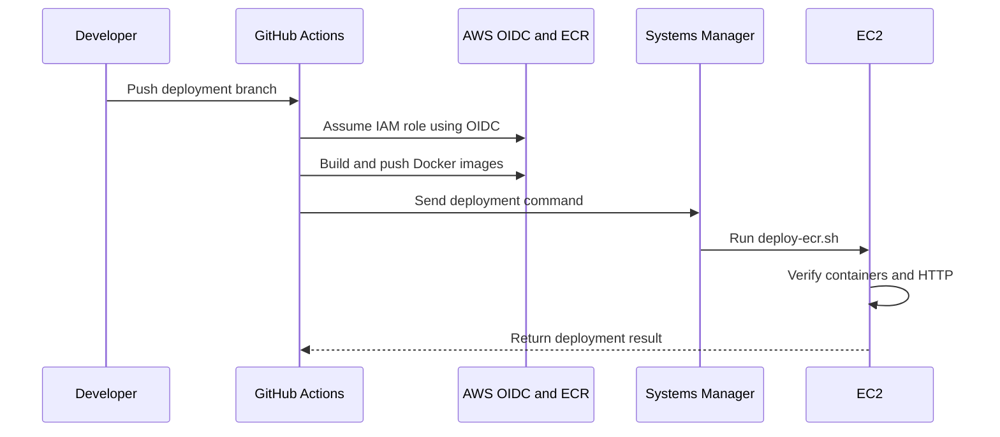

# Thinkz AI CI/CD Pipeline

## Owner

- Name: RK Reddy
- Role: DevOps Cloud Engineer

## Pipeline

## Configuration

- Workflow: `.github/workflows/deploy-prod.yml`
- Branch: `thinkz-ai-ec2-deployment`
- Manual trigger: `workflow_dispatch`
- Region: `ap-south-2`
- EC2 instance: `i-02fe2f396176b851a`
- Authentication: GitHub OIDC
- Deployment: AWS SSM Run Command

## ECR Repositories

- Backend: `thinkz-ai-backend`
- Frontend: `thinkz-ai-frontend`
- Image tags: Git commit SHA and `latest`

## Deployment Process

1. Check out the repository.
2. Assume the AWS role through OIDC.
3. Build backend and frontend images.
4. Push images to Amazon ECR.
5. Run `scripts/deploy-ecr.sh` through SSM.
6. Verify container health, website and API.
7. Restore previous images when validation fails.

## Security

- No long-lived AWS keys are stored in GitHub.
- EC2 administration and deployment use SSM.
- Public SSH port 22 is removed.
- IAM trust is restricted to the repository.

## Verified Results

- GitHub OIDC: Passed
- Backend and frontend builds: Passed
- ECR image push: Passed
- SSM deployment: Passed
- Container health checks: Passed
- Website and API: HTTP 200
- Controlled rollback: Passed
- Latest release restoration: Passed

## Strategy Note

Automated deployment, health verification and rollback are implemented. Full blue-green traffic switching can be added later if specifically required and approved.
